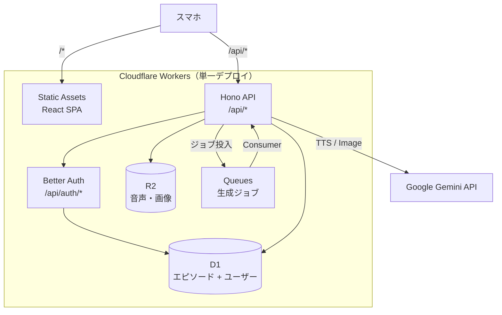

# ai-cast Cloudflare デプロイ計画

## 現状整理

| コンポーネント | 技術スタック | 現在の状態 |
|---|---|---|
| **podcast-gen** | Node.js CLI + Google Gemini API | ローカルCLI（audio/image生成） |

**課題**: podcast-gen はローカル CLI のみ。Web アプリとして動作しない。

**スコープ**: 単一の Cloudflare Workers で API + React SPA を配信するアプリを構築する。スマホ想定。LP は含まない。

---

## ゴール

podcast-gen の機能を **1つの Cloudflare Worker** で完結するアプリとして構築する。

- React SPA（スマホ向けUI）でエピソード一覧・再生・生成リクエスト
- Hono API でポッドキャスト生成・配信・管理
- Better Auth + D1 で認証
- `wrangler deploy` 1回でフロントもAPIもデプロイ

---

## アーキテクチャ



| サービス | 用途 | 理由 |
|---|---|---|
| **Workers + Static Assets** | API + SPA 配信 | 単一デプロイで完結 |
| **D1** | エピソード + ユーザー管理 | SQLite ベースで軽量。Better Auth が D1 対応 |
| **R2** | 音声・画像保存 | S3互換。大容量バイナリに最適 |
| **Queues** | 非同期生成 | TTS は時間がかかるためキュー経由 |

---

## フェーズ

| フェーズ | 内容 |
|---|---|
| Phase 1 | Worker + API 基盤（Hono, D1, R2, Static Assets） |
| Phase 2 | 認証（Better Auth + D1） |
| Phase 3 | 生成ロジック移植（podcast-gen → Worker） |
| Phase 4 | Queues 非同期化 |
| Phase 5 | React SPA（エピソード一覧・再生画面） |
| Phase 6 | デプロイ |

<details>
<summary>Phase 1: Worker セットアップ + API 基盤</summary>

**目的**: Hono API + React SPA が単一 Worker で動作する状態を作る

- [ ] `worker/` ディレクトリ作成
- [ ] Hono 導入、ヘルスチェックエンドポイント (`GET /api/health`)
- [ ] React + Vite セットアップ (`worker/app/`)
- [ ] `wrangler.jsonc` に Static Assets 設定（Vite ビルド出力を配信）
- [ ] D1 バインディング設定、スキーマ作成
- [ ] R2 バインディング設定
- [ ] `wrangler dev` でローカル動作確認

**D1 スキーマ（エピソード）**:

```sql
CREATE TABLE episodes (
  id TEXT PRIMARY KEY,
  title TEXT NOT NULL,
  description TEXT,
  script TEXT,
  audio_key TEXT,
  image_key TEXT,
  duration_seconds INTEGER,
  status TEXT NOT NULL DEFAULT 'pending',
  user_id TEXT NOT NULL,
  created_at TEXT NOT NULL DEFAULT (datetime('now')),
  updated_at TEXT NOT NULL DEFAULT (datetime('now'))
);
```

**wrangler.jsonc（概要）**:

```jsonc
{
  "name": "ai-cast",
  "main": "src/index.ts",
  "assets": {
    "directory": "./public"
  },
  "d1_databases": [{ "binding": "DB", "database_name": "ai-cast-db" }],
  "r2_buckets": [{ "binding": "BUCKET", "bucket_name": "ai-cast-media" }]
}
```

</details>

<details>
<summary>Phase 2: 認証（Better Auth + D1）</summary>

**目的**: ユーザー登録・ログイン・セッション管理を実装する

- [ ] Better Auth 導入（`better-auth` + `better-auth-cloudflare`）
- [ ] D1 にユーザー・セッションテーブル作成（Better Auth が自動マイグレーション）
- [ ] Hono に Better Auth ハンドラを `/api/auth/*` でマウント
- [ ] 認証ミドルウェア実装（`/api/episodes/*` を保護）
- [ ] React SPA にログイン画面・認証状態管理を追加

**認証フロー**:

| 方式 | 詳細 |
|---|---|
| メール + パスワード | Better Auth 標準サポート |
| OAuth（Google / GitHub） | 必要に応じて追加可能 |
| セッション管理 | D1 にセッション保存。Cookie ベース |

**Better Auth が作成するテーブル**:

- `user` — ユーザー情報
- `session` — セッション管理
- `account` — OAuth プロバイダー連携
- `verification` — メール認証トークン

</details>

<details>
<summary>Phase 3: 音声・画像生成の移植</summary>

**目的**: podcast-gen の生成ロジックを Worker に移植する

- [ ] `podcast-gen/src/client.ts` → `worker/src/services/` に Gemini クライアント移植
- [ ] `generate-audio.ts` を Workers 互換に書き換え（`fs` → R2、`wav` → 手動WAVヘッダ）
- [ ] `generate-image.ts` を Workers 互換に書き換え
- [ ] Gemini API キーを Workers Secrets で管理
- [ ] 生成 API エンドポイント実装（認証必須）

**Workers 環境の制約対応**:

| 制約 | 対応 |
|---|---|
| `fs` モジュール不可 | R2 に直接書き込み |
| `wav` パッケージ（Node.js依存） | PCM → WAV ヘッダを手動構築（44バイト） |
| CPU 時間制限 | Queues で非同期化 |
| レスポンスサイズ制限 | R2 presigned URL で配信 |

</details>

<details>
<summary>Phase 4: Queues による非同期生成</summary>

**目的**: 音声生成をバックグラウンドジョブ化する

- [ ] Cloudflare Queues 設定（`wrangler.jsonc` に producer/consumer 追加）
- [ ] Queue consumer 実装（生成 → D1 ステータス更新 → R2 保存）
- [ ] エラーハンドリング（リトライ、dead letter queue）

**フロー**:


</details>

<details>
<summary>Phase 5: React SPA（スマホ向けUI）</summary>

**目的**: スマホで使えるエピソード管理・再生画面を構築

- [ ] React + Vite + TanStack Router セットアップ (`worker/app/`)
- [ ] Tailwind CSS 導入
- [ ] ログイン / サインアップ画面
- [ ] エピソード一覧画面（ステータス表示含む）
- [ ] エピソード再生画面（`<audio>` + サムネイル + メタ情報）
- [ ] 生成リクエスト画面（スクリプト入力 or トピック指定）
- [ ] 生成中ステータスのポーリング表示
- [ ] ビルド出力を `worker/public/` に配置

**画面構成（スマホ想定）**:

| 画面 | パス | 認証 | 内容 |
|---|---|---|---|
| ログイン | `/login` | 不要 | メール+パスワード / OAuth |
| 一覧 | `/` | 必要 | エピソードリスト + ステータスバッジ |
| 再生 | `/episodes/:id` | 必要 | サムネイル + 音声プレイヤー + 概要 |
| 生成 | `/new` | 必要 | スクリプト入力 → 生成リクエスト |

</details>

<details>
<summary>Phase 6: デプロイ</summary>

**目的**: Cloudflare に本番デプロイ

- [ ] Cloudflare アカウントにリソース作成（D1, R2, Queues）
- [ ] `wrangler deploy`（API + SPA を一括デプロイ）
- [ ] カスタムドメイン設定（任意）
- [ ] 環境変数・Secrets 設定（GEMINI_API_KEY、BETTER_AUTH_SECRET など）

</details>

---

<details>
<summary>API 一覧</summary>

| メソッド | パス | 認証 | 説明 |
|---|---|---|---|
| `GET` | `/api/health` | 不要 | ヘルスチェック |
| `ALL` | `/api/auth/*` | — | Better Auth（ログイン・登録等） |
| `POST` | `/api/episodes` | 必要 | エピソード生成リクエスト |
| `GET` | `/api/episodes` | 必要 | エピソード一覧 |
| `GET` | `/api/episodes/:id` | 必要 | エピソード詳細 |
| `GET` | `/api/episodes/:id/audio` | 必要 | 音声ファイル配信 |
| `GET` | `/api/episodes/:id/image` | 必要 | サムネイル画像配信 |
| `/*` | — | — | React SPA（Static Assets） |

</details>

---

<details>
<summary>ディレクトリ構成</summary>

```
ai-cast/
├── worker/                     # Cloudflare Workers（単一デプロイ）
│   ├── src/                    # Hono API
│   │   ├── index.ts            # エントリポイント
│   │   ├── routes/
│   │   │   ├── episodes.ts     # エピソード CRUD
│   │   │   └── generate.ts     # 生成リクエスト
│   │   ├── services/
│   │   │   ├── audio.ts        # Gemini TTS
│   │   │   └── image.ts        # Gemini Image
│   │   ├── auth/
│   │   │   └── index.ts        # Better Auth 設定
│   │   ├── queue/
│   │   │   └── consumer.ts     # Queue consumer
│   │   └── db/
│   │       └── schema.sql      # D1 スキーマ
│   ├── app/                    # React SPA（Vite）
│   │   ├── src/
│   │   │   ├── main.tsx
│   │   │   ├── routes/
│   │   │   └── components/
│   │   ├── index.html
│   │   └── vite.config.ts      # outDir: "../public"
│   ├── public/                 # Vite ビルド出力（gitignore）
│   ├── wrangler.jsonc
│   ├── package.json
│   └── tsconfig.json
├── podcast-gen/                # 既存（移植元）
└── lp/                         # 既存（スコープ外）
```

</details>

<details>
<summary>ローカル開発</summary>

```bash
cd ai-cast/worker

# API + SPA 同時開発
npm run dev        # wrangler dev（API。Static Assets も配信）

# フロント単体開発（HMR付き）
npm run dev:app    # vite dev（app/ の開発サーバー。API は wrangler に proxy）
```

**package.json scripts**:

```json
{
  "scripts": {
    "dev": "wrangler dev",
    "dev:app": "vite --config app/vite.config.ts",
    "build:app": "vite build --config app/vite.config.ts",
    "deploy": "npm run build:app && wrangler deploy"
  }
}
```

</details>

<details>
<summary>技術選定詳細</summary>

### API: Hono

- Cloudflare Workers ファーストクラスサポート
- 軽量（Workers のバンドルサイズ制限に収まる）
- TypeScript ネイティブ

### 認証: Better Auth

- OSS（MIT）、無料
- D1 ネイティブ対応（`better-auth-cloudflare` パッケージ）
- メール+パスワード、OAuth（Google / GitHub）
- セッション管理（D1 保存、Cookie ベース）
- Hono ミドルウェアとして統合可能

### フロント: React + Vite

- Workers Static Assets で単一デプロイ
- スマホ向けUIの操作性（音声プレイヤー、ステータスポーリング）
- TanStack Router でファイルベースルーティング
- Tailwind CSS でモバイルファーストなスタイリング

### WAV 生成の Workers 対応

`wav` npm パッケージは Node.js の `stream` に依存するため Workers では使えない。
PCM データに WAV ヘッダ（44バイト）を手動で付与する軽量実装に置き換える。

</details>

<details>
<summary>未決事項・検討ポイント</summary>

1. **音声フォーマット**: WAV は大きい。MP3/OGG への変換が必要か（Gemini 側の出力フォーマット確認が必要）
2. **スクリプト生成**: 現在は手動作成。Gemini でトピックからスクリプト自動生成を追加するか
3. **コスト**: Gemini API の利用料、R2 ストレージ、Workers の実行時間
4. **OAuth プロバイダー**: 初期はメール+パスワードのみか、Google/GitHub も入れるか

</details>
