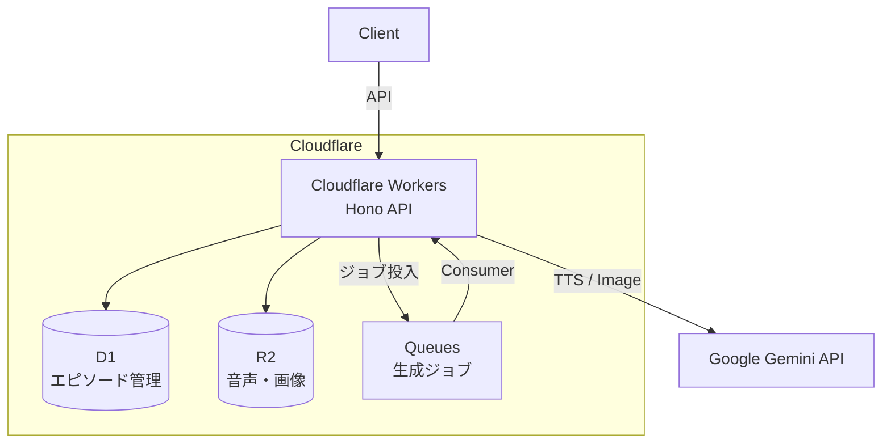
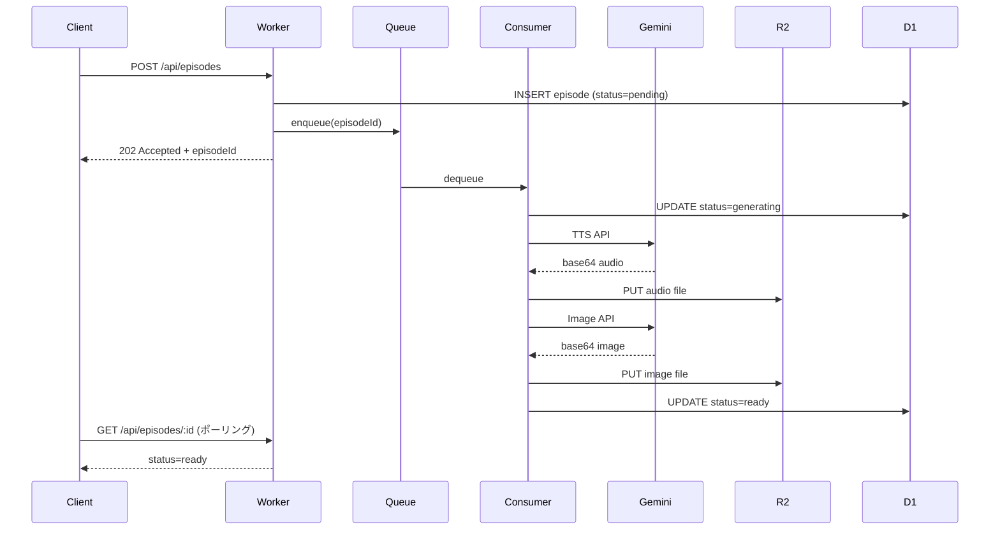

# ai-cast Cloudflare デプロイ計画

## 現状整理

| コンポーネント | 技術スタック | 現在の状態 |
|---|---|---|
| **podcast-gen** | Node.js CLI + Google Gemini API | ローカルCLI（audio/image生成） |

**課題**: podcast-gen はローカル CLI のみ。Web API として動作するバックエンドが存在しない。

**スコープ**: Cloudflare Workers によるバックエンド API（生成・配信・管理）。LP は含まない。

---

## ゴール

podcast-gen の機能を **Cloudflare Workers 上で動作する API** として構築する。

- API 経由でポッドキャスト生成をリクエストできる
- 生成された音声・画像を R2 経由で配信できる
- エピソード管理（メタデータ保存・一覧取得）ができる

---

## アーキテクチャ



| サービス | 用途 | 理由 |
|---|---|---|
| **Workers** | API サーバー | Hono で REST API。軽量かつ柔軟 |
| **D1** | エピソードメタデータ | SQLite ベースで軽量 |
| **R2** | 音声・画像保存 | S3互換。大容量バイナリに最適 |
| **Queues** | 非同期生成 | TTS は時間がかかるためキュー経由 |

---

## フェーズ

| フェーズ | 内容 |
|---|---|
| Phase 1 | Worker + API基盤（Hono, D1, R2） |
| Phase 2 | 生成ロジック移植（podcast-gen → Worker） |
| Phase 3 | Queues 非同期化 |
| Phase 4 | 本番デプロイ |

<details>
<summary>Phase 1: Worker セットアップ + API 基盤</summary>

**目的**: Cloudflare Workers で Hono API が動作する状態を作る

- [ ] `worker/` ディレクトリ作成、`wrangler init` 相当のセットアップ
- [ ] Hono 導入、ヘルスチェックエンドポイント (`GET /api/health`)
- [ ] D1 バインディング設定、スキーマ作成
- [ ] R2 バインディング設定
- [ ] `wrangler dev` でローカル動作確認

**D1 スキーマ（初期）**:

```sql
CREATE TABLE episodes (
  id TEXT PRIMARY KEY,
  title TEXT NOT NULL,
  description TEXT,
  script TEXT,
  audio_key TEXT,
  image_key TEXT,
  duration_seconds INTEGER,
  status TEXT NOT NULL DEFAULT 'pending',
  created_at TEXT NOT NULL DEFAULT (datetime('now')),
  updated_at TEXT NOT NULL DEFAULT (datetime('now'))
);
```

</details>

<details>
<summary>Phase 2: 音声・画像生成の移植</summary>

**目的**: podcast-gen の生成ロジックを Worker に移植する

- [ ] `podcast-gen/src/client.ts` → `worker/src/services/` に Gemini クライアント移植
- [ ] `generate-audio.ts` を Workers 互換に書き換え（`fs` → R2、`wav` → 手動WAVヘッダ）
- [ ] `generate-image.ts` を Workers 互換に書き換え
- [ ] Gemini API キーを Workers Secrets (`wrangler secret put GEMINI_API_KEY`) で管理
- [ ] 生成 API エンドポイント実装

**Workers 環境の制約対応**:

| 制約 | 対応 |
|---|---|
| `fs` モジュール不可 | R2 に直接書き込み |
| `wav` パッケージ（Node.js依存） | PCM → WAV ヘッダを手動構築（44バイト） |
| CPU 時間制限 | Queues で非同期化 |
| レスポンスサイズ制限 | R2 presigned URL で配信 |

</details>

<details>
<summary>Phase 3: Queues による非同期生成</summary>

**目的**: 音声生成をバックグラウンドジョブ化する

- [ ] Cloudflare Queues 設定（`wrangler.jsonc` に producer/consumer 追加）
- [ ] Queue consumer 実装（生成 → D1 ステータス更新 → R2 保存）
- [ ] エラーハンドリング（リトライ、dead letter queue）

**フロー**:



</details>

<details>
<summary>Phase 4: デプロイ</summary>

**目的**: Cloudflare に本番デプロイ

- [ ] Cloudflare アカウントにリソース作成（D1, R2, Queues）
- [ ] Workers デプロイ (`wrangler deploy`)
- [ ] カスタムドメイン設定（任意）
- [ ] 環境変数・Secrets 設定

</details>

---

## API 一覧

| メソッド | パス | 説明 |
|---|---|---|
| `GET` | `/api/health` | ヘルスチェック |
| `POST` | `/api/episodes` | エピソード生成リクエスト |
| `GET` | `/api/episodes` | エピソード一覧 |
| `GET` | `/api/episodes/:id` | エピソード詳細 |
| `GET` | `/api/episodes/:id/audio` | 音声ファイル配信 |
| `GET` | `/api/episodes/:id/image` | サムネイル画像配信 |

---

<details>
<summary>ディレクトリ構成</summary>

```
ai-cast/
├── worker/                  # 新規: Cloudflare Workers バックエンド
│   ├── src/
│   │   ├── index.ts         # Hono エントリポイント
│   │   ├── routes/
│   │   │   ├── episodes.ts  # エピソード CRUD
│   │   │   └── generate.ts  # 生成リクエスト
│   │   ├── services/
│   │   │   ├── audio.ts     # Gemini TTS
│   │   │   └── image.ts     # Gemini Image
│   │   ├── queue/
│   │   │   └── consumer.ts  # Queue consumer
│   │   └── db/
│   │       └── schema.sql   # D1 スキーマ
│   ├── wrangler.jsonc
│   ├── package.json
│   └── tsconfig.json
├── podcast-gen/             # 既存（移植元）
└── lp/                      # 既存（スコープ外）
```

</details>

<details>
<summary>技術選定詳細</summary>

### Hono

- Cloudflare Workers ファーストクラスサポート
- 軽量（Workers のバンドルサイズ制限に収まる）
- TypeScript ネイティブ
- ミドルウェアエコシステム（CORS、認証など）

### WAV 生成の Workers 対応

`wav` npm パッケージは Node.js の `stream` に依存するため Workers では使えない。
PCM データに WAV ヘッダ（44バイト）を手動で付与する軽量実装に置き換える。

</details>

<details>
<summary>未決事項・検討ポイント</summary>

1. **認証**: 現時点ではオープンAPI。必要なら Cloudflare Access や簡易トークン認証を追加
2. **音声フォーマット**: WAV は大きい。MP3/OGG への変換が必要か（Gemini 側の出力フォーマット確認が必要）
3. **スクリプト生成**: 現在は手動作成。Gemini でトピックからスクリプト自動生成を追加するか
4. **コスト**: Gemini API の利用料、R2 ストレージ、Workers の実行時間

</details>
