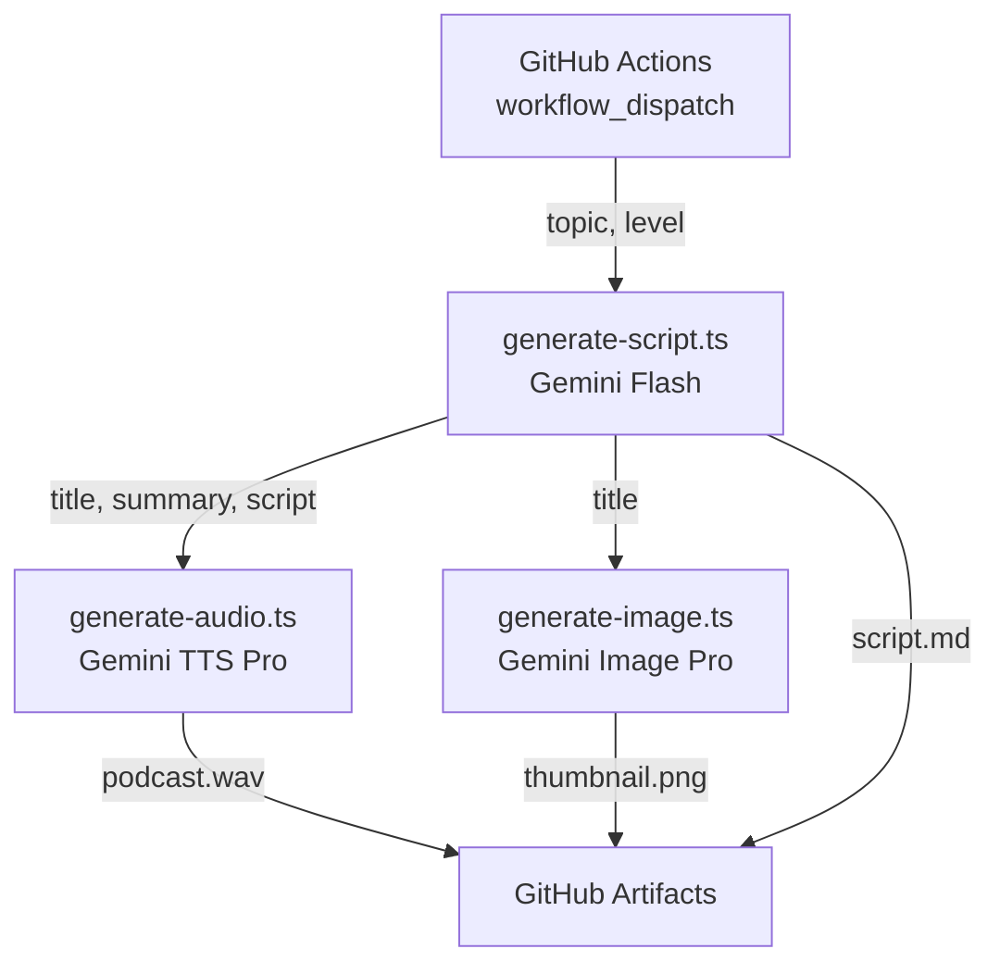
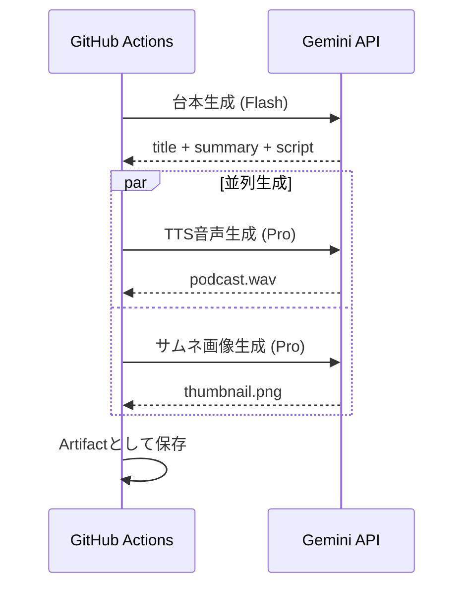
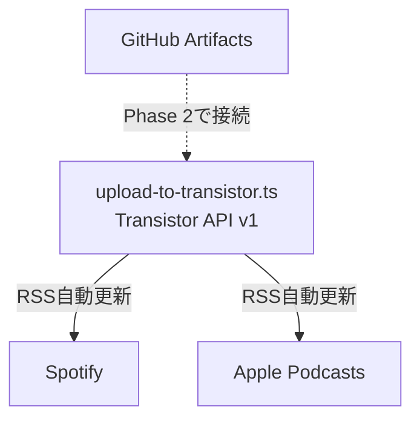

# podcast-gen 自動生成パイプライン

## Context

現在の podcast-gen は手動で台本を書いて音声・画像を生成するCLIツール。
これをGitHub Actionsから **トピック+レベルを指定するだけ** で、台本生成 → 音声化 → サムネ生成まで自動実行できるようにする。

## Phase 1: GitHub Actionsで生成（今回のスコープ）

### パイプライン





### 実装ステップ

#### Step 1: `src/generate-script.ts` (新規)

Geminiにトピック+レベルを渡して MC/ゲスト形式の台本を生成。

- モデル: `gemini-2.5-flash` (台本生成はflashで十分、コスト削減)
- 入力: `topic: string`, `level: "beginner" | "intermediate" | "advanced"`
- 出力: `{ title: string, summary: string, script: string }`
- `responseMimeType: "application/json"` でJSON出力を強制
- プロンプトに `content/episode_001.md` の形式を参考例として組み込み

#### Step 2: `src/generate-audio.ts` (変更)

`generateAudioFromScript(script: string)` を切り出し、パイプラインから文字列を直接渡せるようにする。
既存の `generateAudio(path)` は内部で `generateAudioFromScript` に委譲。後方互換維持。

#### Step 3: `src/generate-image.ts` (変更)

`generateImage(title?: string)` に変更し、タイトルに応じた動的プロンプト生成。
引数なしの場合は既存のハードコードプロンプトを使用（後方互換維持）。

#### Step 4: `main.ts` (変更)

`generate` コマンドを追加。全ステップをオーケストレーション。

```
tsx main.ts generate "Claude Code" "intermediate"
```

生成物は `output/` に保存される（podcast.wav, thumbnail.png, script.md）。

#### Step 5: `.github/workflows/generate-podcast.yml` (新規)

```yaml
on:
  workflow_dispatch:
    inputs:
      topic: { required: true, type: string }
      level: { required: true, type: choice, options: [beginner, intermediate, advanced] }
```

- Secrets: `GEMINI_API_KEY`
- 生成物を `actions/upload-artifact` でArtifactとして保存
- Artifactからダウンロードして内容を確認できる

### ファイル一覧

| ファイル | 操作 |
|---------|------|
| `src/generate-script.ts` | 新規 |
| `.github/workflows/generate-podcast.yml` | 新規 |
| `src/generate-audio.ts` | 変更 (generateAudioFromScript切り出し) |
| `src/generate-image.ts` | 変更 (title引数追加) |
| `main.ts` | 変更 (generateコマンド追加) |

依存パッケージの追加は不要。

### 検証

1. `npx tsx main.ts generate "React" "beginner"` でローカルテスト
2. GitHub Secretsに `GEMINI_API_KEY` を設定し、Actions タブから workflow_dispatch で実行
3. Artifactから生成物をダウンロードして品質確認

---

## Phase 2: Transistor.fm配信（将来）

Phase 1 の生成物の品質が安定したら着手。



- `src/upload-to-transistor.ts` を新規作成
- Transistor API: authorize_upload → PUT audio → POST episode → PATCH publish
- Secrets追加: `TRANSISTOR_API_KEY`, `TRANSISTOR_SHOW_ID`
- コスト: Transistor.fm $19/月 (Starter) + Spotify/Apple掲載は無料
